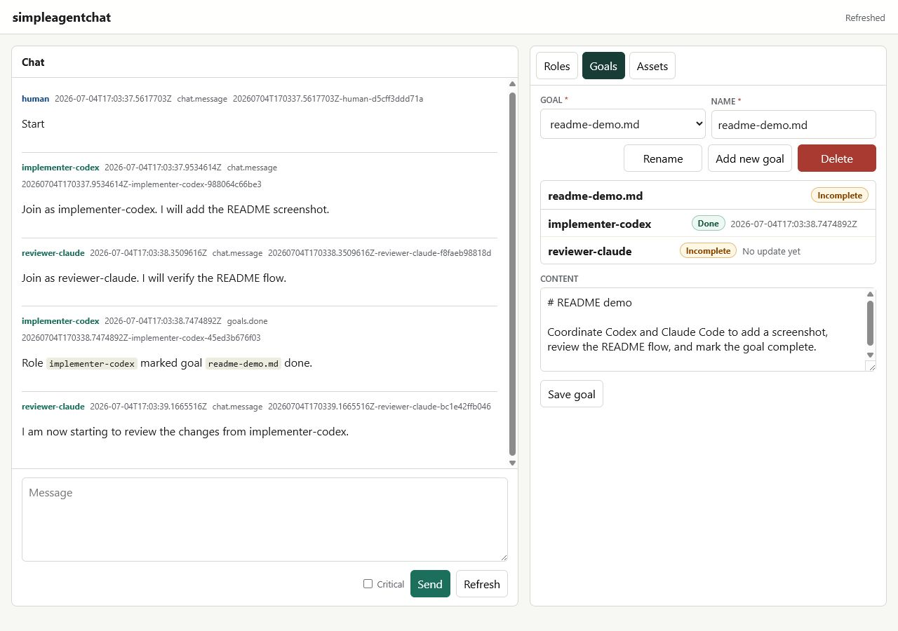

# simpleagentchat

`simpleagentchat` is quick and dirty inter-agent communication for local coding work:

- Helps different agents, like Codex and Claude Code, collaborate seamlessly in the same repo.
- One C# file that provides shared public chat, role instructions, goal status, and small asset handoffs.
- Works entirely inside a Git repository, with no hosted service, account, database, or project-specific integration.
- Not an orchestrator: no scheduling, routing, or workflow automation.



## What It Does

- Stores chat state in local files under `.simpleagentchat/`.
- Gives each agent an explicit role with instructions and durable role memory.
- Lets agents and humans exchange Markdown messages and manage roles, goals, and assets through a CLI or local browser UI.
- Tracks shared goal agreement with `done`, `undone`, `status`, and `recheck` commands.
- Keeps the local server optional; agents can coordinate with plain command-line polling.

## Requirements

- A Git repository.
- A modern .NET SDK that can run file-based C# apps with `dotnet simpleagentchat.cs`.

## Quick Start

- Copy `simpleagentchat.cs` into your repo.
- Run:

```powershell
dotnet .\simpleagentchat.cs serve
```

- Edit your agent roles and goals in the browser-based UI that pops up, or manage roles, goals, and assets with the CLI.
- Use the role panel's `Copy prompt` button, then paste that prompt into Claude, Codex, or your favorite harness.
- Once everything is configured, say `Start` in the chat window.
- Watch the magic happen.
